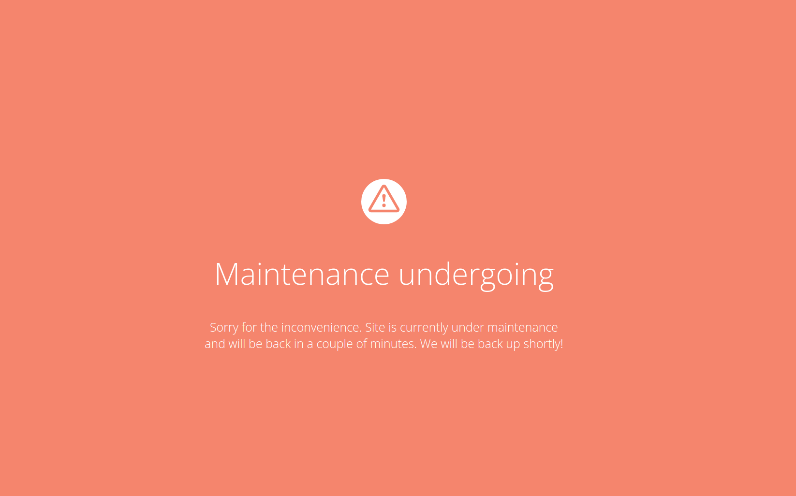
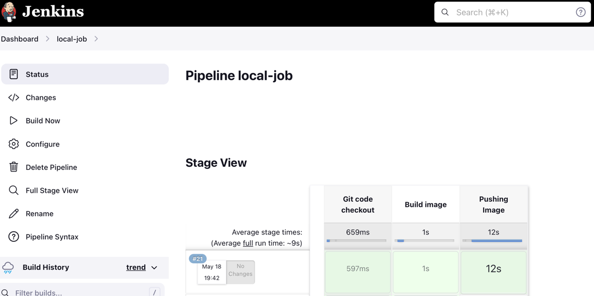
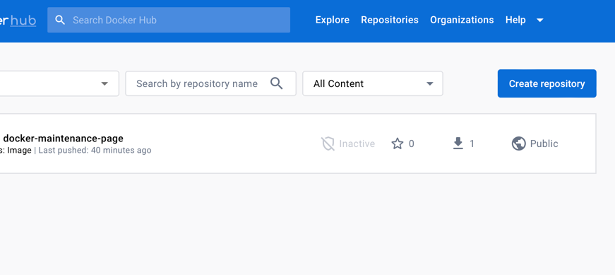

# docker-maintenance-page
This is a simple html maintenance page running in a docker container and can be
be simply used in a deployment process of your application.

# Usage
This is a simple html maintenance page running in a docker container and can
be simply used in a deployment process of your application. After running the container,
a simple page is shown defined in index.html. Content of the page can be defined in a Dockerfile or
docker-compose.yml file.

# External sources
Html page was obtained here: https://codepen.io/calvinbramlett/pen/WOMzqx

# Pre-requisite
- git checkout https://github.com/timv5/docker-maintenance-page.git
- Docker (docker compose) installed
- Jenkins (optional)

# Run the application locally on docker
In root directory run: docker-compose -f docker-compose up -d

# Showcase

# Deployment CI/CD
Project can be also configured for CI/CD process. Steps/how it works?
1. run jenkins job
2. jenkins pull changes from github repository
3. jenkins builds docker image
4. jenkins push docker image to remote repository in this case dockerhub

### 1. Install jenkins locally on a computer
- install brew
- run: brew install jenkins-lts
- run: brew services restart jenkins-lts
- run: brew services start jenkins-lts
- (mac) allow jenkins to run docker commands. Open and apply: <key>EnvironmentVariables</key><dict><key>PATH</key><string>/usr/local/bin:/usr/bin:/bin:/usr/sbin:/sbin:/Applications/Docker.app/Contents/Resources/bin/:/Users/Kh0a/Library/Group\ Containers/group.com.docker/Applications/Docker.app/Contents/Resources/bin</string></dict>
in:  /opt/homebew/Cellar/jenkins-lts/2.176.3/homebrew.mxcl.jenkins-lts.plist

### Setup Jenkins
- accessible on: http://localhost:8080
- run and get initial pass: cat /Users/{user}/.jenkins/secrets/initialAdminPassword
- choose install suggested plugins
- create new pipeline - copy /jenkins/Jenkinsfile to pipeline script section and change {dockerHubAccountName} to your dockerhub account name
- setup credentials:
  - github (name should be "githublogin")
  - dockerhub (name should be "dockerhublogin")
- install following plugins
  - docker pipeline
  - docker plugin
- build job

### CI/CD result

go to https://hub.docker.com/login and image should be seen under your account

